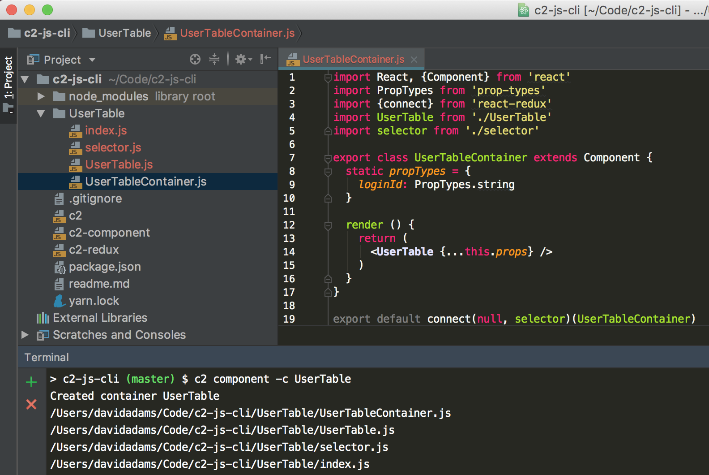
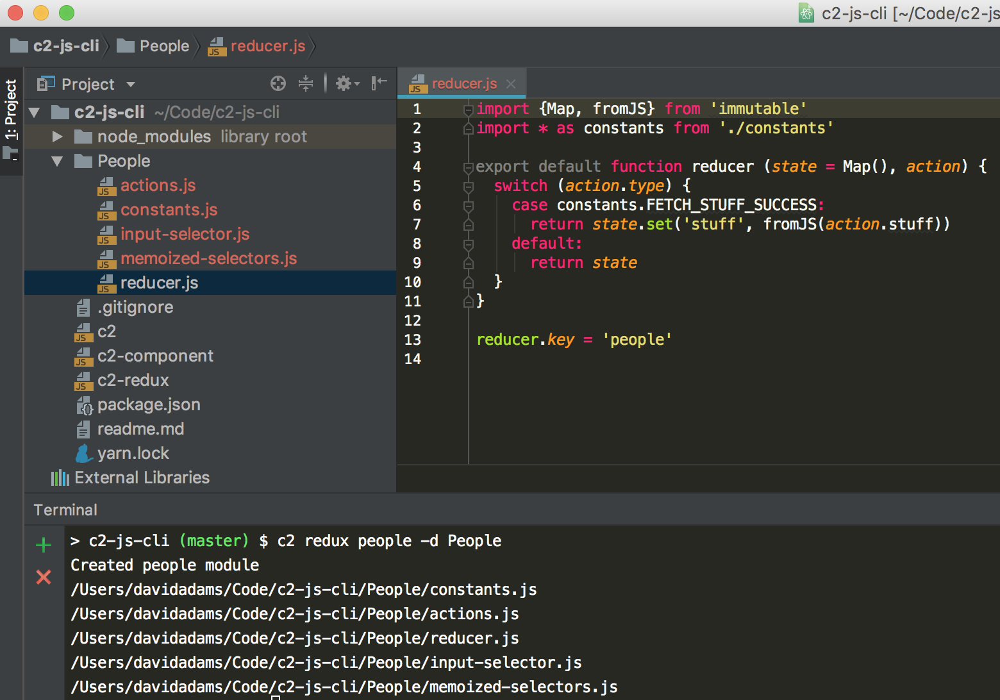

# c2-js-cli
This package contains a cli tools to aid in react/redux development.

## Installation
Add the cli tools globally instead of at the project level.
```
yarn global add ClearC2/c2-js-cli
```
This will add the `c2` cli tool to your global environment. Run `c2 --help` for the available commands.

## c2 component [name]
Scaffold a component/container.

Creates the following for normal component:
- component directory
- component file
- index file that exports component
- component test directory
- component test file

Passing the `-c` or `--container` option creates the following for container component:
- component directory
- component file
- component test directory
- component test file
- selector file
- container file that imports/uses component, selector
- index file that exports container
- container test directory
- container test file

### Usage
```sh
# in the location you wish to create the component

c2 component UserTable    # scaffolds a component
c2 component -c UserTable # scaffolds a container
```


## c2 redux [name]
Scaffolds a redux module.

Creates the following:
- constants file
- actions file
- reducer file
- input selectors file
- memoized selectors file

### Usage
```sh
# in the location you wish to create the component

c2 redux people           # creates a "redux" directory and associated files within
c2 redux people -d People # creates a "People" directory and associated files within
```


